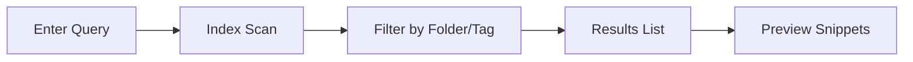

## Overview

Discover the core features of * that empower you to organize, collaborate, and maintain your project documentation efficiently. You create structured spaces, invite team members, search content instantly, and track changes with version history. These capabilities ensure your docs stay current and accessible.

<Columns cols={2}>
  <Card title="Document Folders" icon="folder" href="#document-folders">
    Organize docs hierarchically for easy navigation.
  </Card>
  <Card title="Team Collaboration" icon="users" href="#collaboration">
    Real-time editing and permissions for teams.
  </Card>
  <Card title="Search & Filter" icon="search" href="#search">
    Find content quickly across your docs.
  </Card>
  <Card title="Version Control" icon="git-branch" href="#version-control">
    Track and revert changes effortlessly.
  </Card>
</Columns>

## Document Organization and Folders

You structure your documentation using folders and subfolders, mimicking your project's file system. Create a root folder for your project, then nest pages logically, such as `api/`, `guides/`, and `reference/`.

<Steps>
  <Step title="Create a Folder" icon="plus">
    Navigate to your project dashboard at `https://dashboard.example.com/projects/{projectId}`.

    Click **New Folder** and enter a name like `API Reference`.
  </Step>
  <Step title="Nest Documents" icon="folder-plus">
    Drag pages into folders or use the folder picker when creating new docs.
  </Step>
  <Step title="Reorder" icon="move">
    Use drag-and-drop to adjust hierarchy.
  </Step>
</Steps>

<Callout kind="tip">
  Limit folder depth to three levels for optimal navigation.
</Callout>

## Collaboration Tools for Teams

Invite teammates to collaborate with granular permissions. Assign roles like Editor, Viewer, or Admin, and enable real-time co-editing.

<Tabs>
  <Tab title="Invite User" icon="user-plus">
    ```javascript
    // API call to invite collaborator
    const response = await fetch('https://api.example.com/v1/projects/{projectId}/invites', {
      method: 'POST',
      headers: { 'Authorization': `Bearer ${YOUR_API_KEY}` },
      body: JSON.stringify({
        email: 'team@company.com',
        role: 'editor'
      })
    });
    ```
  </Tab>
  <Tab title="Set Permissions" icon="shield">
    In the dashboard, select a user and choose from Viewer, Editor, or Admin roles.
  </Tab>
</Tabs>

<CodeGroup tabs="JavaScript,Python">
  ```javascript
  // Update document permissions
  await fetch(`https://api.example.com/docs/{docId}/permissions`, {
    method: 'PATCH',
    body: JSON.stringify({ canEdit: true })
  });
  ```
  ```python
  import requests
  response = requests.patch(
    'https://api.example.com/docs/{docId}/permissions',
    json={'canEdit': True},
    headers={'Authorization': f'Bearer {YOUR_API_KEY}'}
  )
  ```
</CodeGroup>

## Search and Filtering Capabilities

Search across all documents with full-text indexing. Filter by folder, tag, or author for precise results.



Use advanced operators like `folder:api` or `tag:internal`.

<Expandable title="Advanced Search Syntax" default-open="false">
  - `title:setup` - Matches document titles
  - `author:john` - Docs by specific user
  - `"exact phrase"` - Phrase search
</Expandable>

## Version Control for Documents

Every edit creates a version. View history, compare changes, and restore previous states.

<ParamField path="docId" param-type="string" required="true">
  Document identifier for version API.
</ParamField>

<Request tabs="JavaScript,cURL" show-lines="true">
  ```javascript
  const versions = await fetch(`https://api.example.com/docs/{docId}/versions`, {
    headers: { 'Authorization': `Bearer ${YOUR_API_KEY}` }
  }).then(r => r.json());
  ```
  ```bash
  curl -H "Authorization: Bearer $YOUR_API_KEY" \
       https://api.example.com/docs/{docId}/versions
  ```
</Request>

<Response tabs="200">
  ```json
  {
    "versions": [
      {
        "id": "v1.2",
        "createdAt": "2024-10-15T10:00:00Z",
        "changes": ["Added API endpoints"]
      }
    ]
  }
  ```
</Response>

<Callout kind="info">
  Versions are retained for 90 days. Export them via API for longer storage.
</Callout>