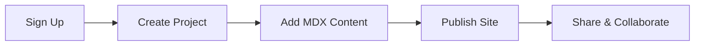

## Overview

Welcome to *'s documentation platform. You get a centralized space to create, organize, and publish all your project documentation. Whether you document APIs, user guides, or internal wikis, * streamlines the process with intuitive tools and powerful features. Focus on content while * handles versioning, search, and collaboration.

## Key Features

* offers essential tools to supercharge your documentation workflow. Explore these core capabilities:

<Columns cols={3}>
  <Card title="Visual MDX Editor" icon="edit-3" href="#visual-editor">
    Build rich docs with drag-and-drop components, live previews, and syntax highlighting.
  </Card>
  <Card title="Version Control" icon="git-branch" href="#version-control">
    Track changes, collaborate with teams, and roll back edits effortlessly.
  </Card>
  <Card title="Search & Analytics" icon="search" href="#search-analytics">
    Full-text search and usage insights help users find content quickly.
  </Card>
</Columns>

<Columns cols={2}>
  <Card title="Custom Domains" icon="globe" href="#custom-domains">
    Host docs on your domain with SEO optimization and branding.
  </Card>
  <Card title="Integrations" icon="plug" href="#integrations">
    Connect with GitHub, Slack, and more for seamless workflows.
  </Card>
</Columns>

## Quick Start

Get up and running in minutes. Follow these steps to create your first documentation site.

<Steps>
  <Step title="Sign Up" icon="user-plus">
    Create a free account at `https://dashboard.example.com/signup`.
  </Step>
  <Step title="Create Project" icon="plus">
    Click "New Project" and name it, like "My API Docs".
  </Step>
  <Step title="Add Content" icon="file-text">
    Use the MDX editor to write your first page. Here's a simple example:
    
    <CodeGroup tabs="MDX,Markdown">
    ````mdx
    ---
    title: Hello World
    ---

    ## Welcome

    This is your first doc page.
    ````
    
    ````markdown
    # Hello World

    This is your first doc page.
    ````
    </CodeGroup>
  </Step>
  <Step title="Publish" icon="rocket">
    Hit "Publish" to generate a live site at `https://docs.example.com/your-project`.
  </Step>
</Steps>

<Callout kind="tip">
  Pro tip: Enable auto-publishing from GitHub for continuous deployment.
</Callout>

## Why Choose *?

You select * for its balance of simplicity and power. Unlike static site generators, * provides a no-code editor with advanced MDX support. Teams love real-time collaboration, while developers appreciate Git integration. Scale from small projects to enterprise docs without limits.

<Expandable title="Advanced Customization" default-open="false">
  Customize themes with CSS variables, like setting your brand color to `#3B82F6`. Embed custom components or integrate analytics.
</Expandable>

## Next Steps

Ready to dive deeper?

<Columns cols={2}>
  <Card title="Quickstart Guide" icon="book-open" href="/quickstart">
    Detailed setup and first project walkthrough.
  </Card>
  <Card title="Authentication" icon="shield" href="/authentication">
    Secure your docs with API keys and teams.
  </Card>
</Columns>



Explore the sidebar for more guides. Start building today!